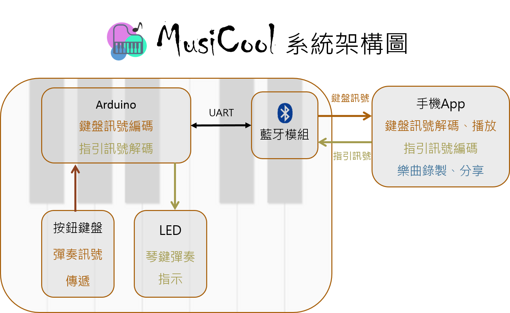
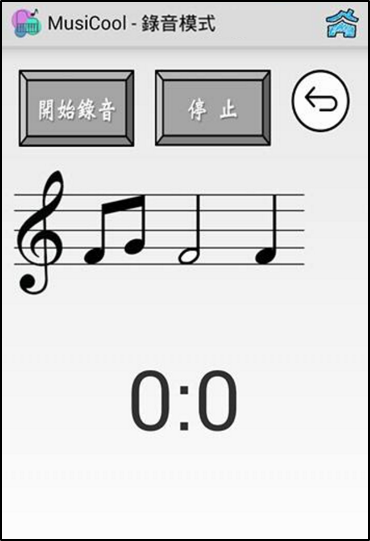

# MusiCool

- 本作品為一組能彈奏與學習樂曲的系統，**嵌入式鋼琴** + **Android App**
- 提供彈奏、學習、錄音等功能
- 此為Android App的部分，嵌入式鋼琴已損壞，本App暫無法獨立使用
- 開發語言: Android
- 開發平台: Android Studio
- 應用: `Bluetooth`, `SQLite`, `SoundPool`, `Timer`
- Demo: https://www.youtube.com/watch?v=bZjE19V5-94

系統架構圖
---

功能
---
## 1. 學習模式(Learning mode)
將樂曲用LED亮燈指引的方式引導使用者彈奏。首先由Android APP載入由使用者選定的歌曲後，控制琴鍵對應的LED燈依歌曲的音階而燈亮，引導所需彈奏的音符。根據這樣的流程，指引使用者跟著LED燈的明滅敲擊琴鍵，以彈奏出一首首優美的曲子，同時學習彈奏的技巧，以增進學習鋼琴之興趣。

## 2. 自彈模式(Playing mode)
一般的鋼琴彈奏模式，使用者彈下每一個琴鍵時，Android App都會播放對應的琴音，就像是用真正的鋼琴彈奏。

## 3. 錄音模式(Recording mode)
主要實現樂曲創作的功能。使用Android App開啟本模式並選擇錄音後，會開始記錄使用者所彈奏的音，直到停止鍵被按下。此時，Android App會將這段時間內的彈奏紀錄儲存成一個樂曲音檔，可以選擇播放或做為學習模式的教材。

主畫面、錄音及播放畫面
---
  

學習畫面
---

